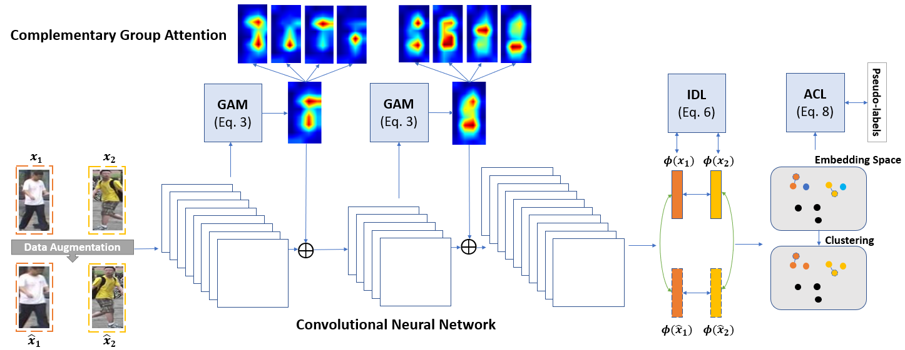

# Unsupervised Attention-Based Instance Discriminative Learning for Person Reidentification

Code located at https://git.unl.edu/ece-unl-images-lab/group-attention-module-person-re-id

This repository contains the implementation for the Workshop on Applications of Computer Vision (WACV) 2021 paper "Unsupervised Attention Based Instance Discriminative Learning for Person Re-Identification
". Recent advances in person re-identification have demonstrated enhanced discriminability, especially with supervised learning or transfer learning. However, since the data requirements---including the degree of data curations---are becoming increasingly complex and laborious, there is a critical need for unsupervised methods that are robust to large intra-class variations, such as changes in perspective, illumination, articulated motion, resolution, etc. Therefore, we propose an unsupervised framework for person re-identification which is trained in an end-to-end manner without any pre-training. Our proposed framework leverages a new attention mechanism that combines group convolutions to (1) enhance spatial attention at multiple scales and (2) reduce the number of trainable parameters by 59.6%. Additionally, our framework jointly optimizes the network with agglomerative clustering and instance learning to tackle hard samples. We perform extensive analysis using the Market1501 and DukeMTMC-reID datasets to demonstrate that our method consistently outperforms the state-of-the-art methods (with and without pre-trained weights).

When using and referencing this repository, including derivative works, please cite the paper as:

```
@InProceedings{Nikhal_2021_WACV, 
    author    = {Nikhal, Kshitij and Riggan, Benjamin S.},
    title     = {Unsupervised Attention Based Instance Discriminative Learning for Person Re-Identification},
    booktitle = {Proceedings of the IEEE/CVF Winter Conference on Applications of Computer Vision (WACV)},
    month     = {January},
    year      = {2021},
    pages     = {2422-2431}
}
```

### Architecture Overview


### GAM Block Overview


### Prerequisites

This repository is tested on Python 3.6 but should work on most Python 3 versions. The following libraries are needed:
pytorch 1.4.0
scikit-learn 0.23.2
metric-learn 0.6.2
numpy 1.16.4


### Datasets
Market1501

DukeMTMC-reID

[Download Data](https://uofnelincoln-my.sharepoint.com/:u:/g/personal/knikhal2_unl_edu/EbwgLfWr4GVLvJOHtCwZmAwBrrFBWR6N8qEaLwI_lBFzHw?e=b3UceZ) - Extract data folder in root directory. 
### Instructions to Run
Set desired configuration in `constants.py`. 

#### Train
Run `python3 main.py`. To restore saved model and resume training, set `saved_model` in constants.py. To start training with pre-trained ImageNet weights, [download ImageNet weights](https://uofnelincoln-my.sharepoint.com/:u:/g/personal/knikhal2_unl_edu/EfxLbjPkeX5Gr2VGCyUBJPoBygMIBiSeyuVQkE1o2cgZHA?e=rGBUfy) and set `IMAGENET_WEIGHTS` path in `constants.py`.


#### Evaluate
Set `TEST_ONLY` to `True` and `saved_model` in constants.py. Run `python3 main.py`.
Pretrained models can be downloaded from [here](https://uofnelincoln-my.sharepoint.com/:f:/g/personal/knikhal2_unl_edu/EnAxqNXUw65FsFd7aj_NWKIB3EBovqf9x2I3MTYS1BBn8w?e=ghIR8m)
#### Contact
* **Kshitij Nikhal** - University of Nebraska-Lincoln - knikhal2@huskers.unl.edu
* **Benjamin S. Riggan** - University of Nebraska-Lincoln - briggan2@unl.edu


